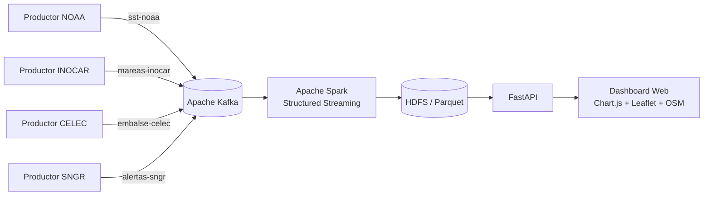

# FloodWatchEC

Plataforma Big Data para el monitoreo cuasi en tiempo real del fenómeno de El Niño y del riesgo de inundaciones en Guayaquil.

## 1. Descripción

FloodWatchEC integra datos climáticos y ambientales mediante Apache Kafka, procesa eventos con Apache Spark Structured Streaming, almacena resultados en HDFS y expone la información mediante una API desarrollada con FastAPI. El dashboard utiliza Chart.js y Leaflet sobre OpenStreetMap para mostrar indicadores, series temporales, zonas vulnerables, escenarios de lluvia y marea, y una ruta de evacuación sugerida.

> Nota: para la demostración académica, las variables de marea, nivel del embalse y alerta SNGR se incorporan como valores realistas dentro del job de Spark. Los productores Kafka independientes de INOCAR, CELEC y SNGR quedan implementados como parte de la arquitectura y pueden integrarse posteriormente mediante procesamiento separado o joins temporales con watermarks.

## 2. Arquitectura



## 3. Tecnologías

- Python 3.12
- Apache Kafka 3.8.0 en modo KRaft
- Apache Spark 4.1.2 y Scala 2.13
- Hadoop/HDFS 3.5.0
- FastAPI y Uvicorn
- Kafka-Python
- Chart.js
- Leaflet
- OpenStreetMap
- HTML, CSS y JavaScript

## 4. Estructura principal

```text
FloodWatchEC/
├── api/
│   └── main.py
├── dashboard/
│   ├── css/
│   │   └── style.css
│   ├── js/
│   │   └── app.js
│   └── index.html
├── kafka/
│   ├── consumers/
│   └── producers/
│       ├── noaa_producer.py
│       ├── inocar_producer.py
│       ├── celec_producer.py
│       └── sngr_producer.py
├── spark/
│   └── streaming/
│       └── process_stream.py
├── hdfs/
├── docs/
├── tests/
├── requirements.txt
└── README.md
```

## 5. Topics de Kafka

```text
sst-noaa
precip-gpm
mareas-inocar
embalse-celec
alertas-sngr
```

## 6. Variables procesadas

- Timestamp
- Temperatura
- Precipitación
- Viento
- Ciudad
- Nivel de marea
- Nivel del embalse Daule-Peripa
- Alerta SNGR
- Nivel de riesgo: BAJO, MEDIO, ALTO o CRÍTICO
- Índice de riesgo de 0 a 100

## 7. Reglas del riesgo

El job de Spark clasifica el riesgo mediante reglas simplificadas y justificables:

- **CRÍTICO:** temperatura ≥ 30 °C, precipitación ≥ 20 mm, marea ≥ 3.5 m y embalse ≥ 85 %.
- **ALTO:** temperatura ≥ 30 °C y precipitación ≥ 10 mm.
- **MEDIO:** temperatura ≥ 28 °C o marea ≥ 3.0 m.
- **BAJO:** condiciones inferiores a los umbrales anteriores.

## 8. Ejecución

Se recomienda usar una terminal diferente para cada servicio.

### 8.1 Iniciar Hadoop

```bash
start-dfs.sh
jps
```

Deben aparecer `NameNode`, `DataNode` y `SecondaryNameNode`.

### 8.2 Iniciar Kafka

```bash
cd ~/kafka
bin/kafka-server-start.sh config/kraft/server.properties
```

Verificación:

```bash
bin/kafka-topics.sh --list --bootstrap-server localhost:9092
```

### 8.3 Iniciar el productor NOAA

```bash
cd ~/FloodWatchEC
source venv/bin/activate
python kafka/producers/noaa_producer.py
```

Los demás productores pueden ejecutarse en terminales adicionales:

```bash
python kafka/producers/inocar_producer.py
python kafka/producers/celec_producer.py
python kafka/producers/sngr_producer.py
```

### 8.4 Iniciar Spark Structured Streaming

```bash
cd ~/FloodWatchEC
source venv/bin/activate

spark-submit \
  --packages org.apache.spark:spark-sql-kafka-0-10_2.13:4.1.2 \
  spark/streaming/process_stream.py
```

### 8.5 Iniciar FastAPI

```bash
cd ~/FloodWatchEC
source venv/bin/activate
uvicorn api.main:app --reload
```

Direcciones de prueba:

```text
http://localhost:8000/
http://localhost:8000/ultimo
http://localhost:8000/datos
http://localhost:8000/estadisticas
http://localhost:8000/ciudades
http://localhost:8000/docs
```

### 8.6 Iniciar el dashboard

```bash
cd ~/FloodWatchEC/dashboard
python3 -m http.server 8080
```

Abrir:

```text
http://localhost:8080
```

## 9. Funciones del dashboard

- Tarjetas de temperatura, viento, precipitación, riesgo, marea, embalse, alerta e índice.
- Actualización automática cada cinco segundos.
- Gráfico temporal de temperatura y precipitación.
- Historial de alertas.
- Mapa interactivo sobre OpenStreetMap.
- Capas activables y desactivables.
- Marcadores de ciudades.
- Polígonos de zonas vulnerables de Guayaquil.
- Capa de precipitación.
- Capa de marea.
- Escenario combinado de lluvia y marea alta.
- Ruta de evacuación sugerida.
- Leyenda de riesgo.

## 10. Almacenamiento

Los datos procesados se guardan en formato Parquet en:

```text
hdfs://localhost:9000/FloodWatchEC/processed
```

Los checkpoints se almacenan en:

```text
hdfs://localhost:9000/FloodWatchEC/checkpoints_v2
hdfs://localhost:9000/FloodWatchEC/checkpoints_console
```

## 11. Limitaciones

- Los productores generan datos realistas simulados para garantizar una demostración reproducible.
- El job principal usa NOAA como stream base y añade valores representativos de marea, embalse y alerta, evitando joins entre streams sin watermarks.
- Los polígonos de vulnerabilidad son aproximaciones académicas y no sustituyen estudios hidráulicos oficiales.
- La ruta de evacuación mostrada es una sugerencia visual y debe validarse con una red vial y un motor de ruteo en una implementación productiva.
- No se implementa un modelo hidráulico profesional.
